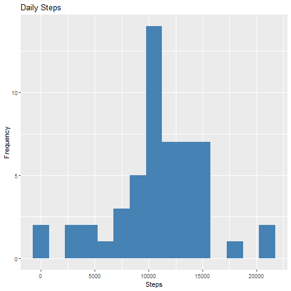

## 1) loading the data from working directory

```{r, echo=FALSE}
library(data.table)
library(dplyr)
library(ggplot2)
library(gridExtra)
```


reading the data
```{r}

tabla<-read.csv("activity.csv")

```

Calculate the number of steps taken per day:

```{r,echo=FALSE}

daily_steps = tapply(tabla$steps,tabla$date,sum,na.rm=FALSE)
daily_steps = data.frame(daily_steps)
tabla$date<-as.Date(tabla$date)
daily_steps[,"dates"]<-c(unique(tabla$date))

```


```{r}
head(daily_steps,10)
```

## 2)ploting a histogram of the total steps taken per day

```{r}

plot1<-ggplot(daily_steps,aes(x= daily_steps))
plot1 + geom_histogram(fill="steelblue",binwidth = 1500) + labs(title = "Daily Steps", x = "Steps", y = "Frequency")

```

<!-- -->

## 3) calculate the mean and the median

```{r}

pregunta2<-c(mean(daily_steps[,1],na.rm = TRUE),median(daily_steps[,1],na.rm=TRUE))
pregunta2

```

## 4) Calculate a Time series plot of the average number of steps taken

```{r}

steps_by_interval <- tapply(tabla$steps,tabla$interval,mean,na.rm=TRUE)
steps_by_interval = data.frame(steps_by_interval)
steps_by_interval[,"intervals"]=c(unique(tabla$interval))

```

time series plot of average steps by intervals

```{r}

plot2<-ggplot(steps_by_interval,aes(x=intervals,y=steps_by_interval))
plot2+geom_line(color="red",size=2)+labs(title = "Avg Steps by interval",y="steps")
```

## 5) Calculate The 5-minute interval that, on average, contains the maximum number of steps

```{r}

filter(steps_by_interval,steps_by_interval==max(steps_by_interval))

```

## 6) Code to describe and show a strategy for imputing missing data

summary function applied to the data will bring the amount of NA values

```{r}
summary(tabla$steps)
```

Na missing values are going to be replaced by the median value of steps

```{r, echo=FALSE}

mediana_pasos<-median(tabla$steps,na.rm = TRUE)

copia = copy(tabla)

copia[is.na(copia$steps),"steps"]<-c(mediana_pasos)

```

Now we can test if we replaced the NA's

```{r}

summary(copia$steps)

```

## 7) Histogram of the total number of steps taken each day after missing values are imputed

```{r, echo=FALSE}

daily_steps_copia = tapply(copia$steps,copia$date,sum,na.rm=FALSE)
daily_steps_copia = data.frame(daily_steps_copia)
daily_steps_copia[,"dates"]<-c(unique(copia$date))
colnames(daily_steps_copia)<-c("steps","dates")

```

New histogram

```{r}

plot3<-ggplot(daily_steps_copia,aes(x=steps))
plot3+geom_histogram(fill="red",binwidth = 1500)+labs(title = "Daily Steps", x = "Steps", y = "Frequency")

```


comparisson between with NA and without NA

```{r}
summary(daily_steps$daily_steps)
summary(daily_steps_copia$steps)
```

## 8) Panel plot comparing the average number of steps taken per 5-minute interval across weekdays and weekends

arranging the data to inlude weekday factor

```{r}
copia[,"weekday"]<-weekdays(copia$date)

patron_sem<-("Monday|Tuesday|Wednesday|Thursday|Friday")
patron_finde<-("Saturday|Sunday")
sem<-grepl(patron_sem,copia$weekday,ignore.case = TRUE)
findesemana<-grepl(patron_finde,copia$weekday,ignore.case = TRUE)
copia[sem,"sem_o_fin"]<-c("weekday")
copia[findesemana,"sem_o_fin"]<-c("weekend")

weekday<-filter(copia,sem_o_fin=="weekday")
weekday_by_interval<-as.data.frame(tapply(weekday$steps,weekday$interval,mean,na.rm=TRUE))
weekday_by_interval[,"intervals"]=c(unique(weekday$interval))
colnames(weekday_by_interval)<-c("Average_Steps","interval")

weekend<-filter(copia,sem_o_fin=="weekend")
weekend_by_interval<-as.data.frame(tapply(weekend$steps,weekend$interval,mean,na.rm=TRUE))
weekend_by_interval[,"intervals"]=c(unique(weekend$interval))
colnames(weekend_by_interval)<-c("Average_Steps","interval")
```

panel plot

```{r}
plot5<-ggplot(weekday_by_interval,aes(x=interval,y=Average_Steps))
plot5<-plot5+geom_line(color="steelblue")+labs(title = "Weekday")
plot6<-ggplot(weekend_by_interval,aes(x=interval,y=Average_Steps))
plot6<-plot6+geom_line(color="red")+labs(title = "Weekend")

grid.arrange(plot5,plot6,nrow=1)
```

